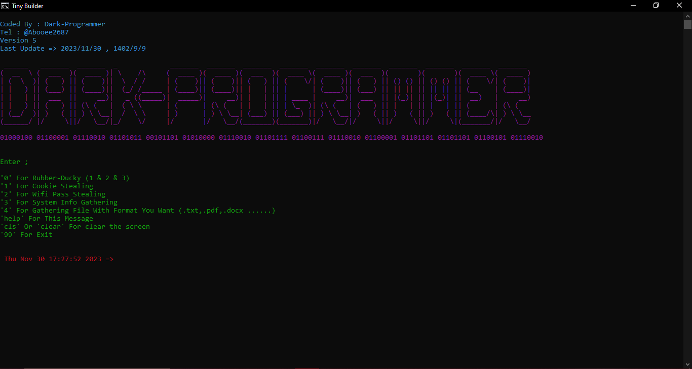

# Tiny-Builder

## Malware Creator

> [!WARNING]
> I am NOT responsible for any demages caused by this software to anyone. I do NOT support any malicious use of this software. This is for educational purposes only.

### How To Use ;

> [!NOTE]
> YOU Should Install Python In YOUR System First . [ Download Python From Here](https://python.org)

Windows:
`pip install -r requirements.txt` & `python Tiny-Builder.py`

Linux:
`python3 -m pip install -r requirements.txt` & `python3 Tiny-Builder.py`

### Features

Creating 'exe' Apps For amd64 / x86 Windows Systems The Apps Are ;

1. Cookie Stealing : Stealing Google Saved Pass & username & link to login page
2. Wifi Pass Stealing : Stealing Pass Of The Wifi Computer Connected Befor
3. System Info Gathering : Getting System Information (Like Running 'systeminfo' In CMD)
4. Gathering Files With One Or More Format YOU Want Like .pdf , .txt , .docx & ..... (YOU Can Choose More Than One Format)

